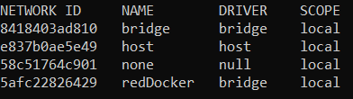
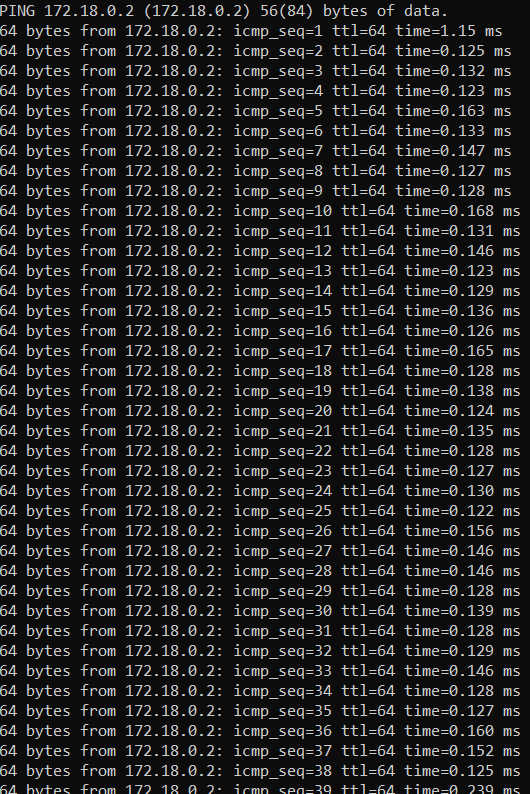

# Parte 1

## 1.

docker volume create volumenDocker

## 2.

docker run -d -p 80:80 -v volumenDocker:/usr/share/nginx/html --name volumenDocker nginx

## 3.

docker exec -it volumenDocker /bin/bash
echo '<!DOCTYPE html><html><head><title>Pagina de Manuel</title></head><bodi><h1>Hola, soy Manuel</h1></body></html>' > /usr/share/nginx/html/index.html

## 4.

docker run -d -p 81:80 -v volumenDocker:/usr/share/nginx/html --name segundo_contenedor nginx

## 5.

# Parte 2

## 1

docker network create redDocker
El resultado al hacer un ls es:

## 2

docker run -it --name Ubuntu1 ubuntu

## 3

docker run -it --name Ubuntu2 ubuntu

## 4

docker network connect redDocker Ubuntu1

## 5

docker exec -it Ubuntu2 bash
apt-get update
apt-get install -y iputils-ping
ping 172.18.0.2 (es la dirección IP de Ubuntu1)
El comando se queda esperando, esto es, porque no recibe respuesta de Ubuntu1, ya que no están en la misma red.

## 6

docker network connect redDocker Ubuntu1

## 7

